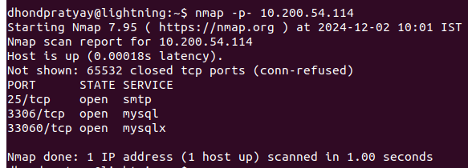
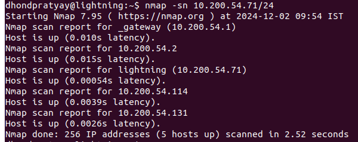
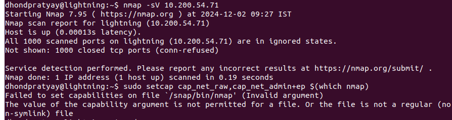

nmap ->  Nmap, or Network Mapper, is a free, open-source network scanning tool that helps identify devices connected to a network and their services and operating systems: 

##### 1)Find Open Ports On A System 
- `nmap -p- <target-IP>`
- find target IP -> `hostname -I`.
- 

##### 2)Find The Machines Which Are Active 
- nmap -sn ip-network-range 
- e.g. `nmap -sn 10.200.54.71/24`
- -sn: Performs a ping sweep to identify live hosts without port scanning.
- 

##### 3)Find The Version Of Remote OS On Other Systems 
- `nmap -O <target-IP>`

##### 4)Find The Version Of S/W(s) Installed On Other System
- `nmap -sV <target-IP>`
- -sV: Performs service/version detection to identify versions of software running on open ports.
- 
