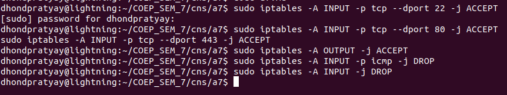
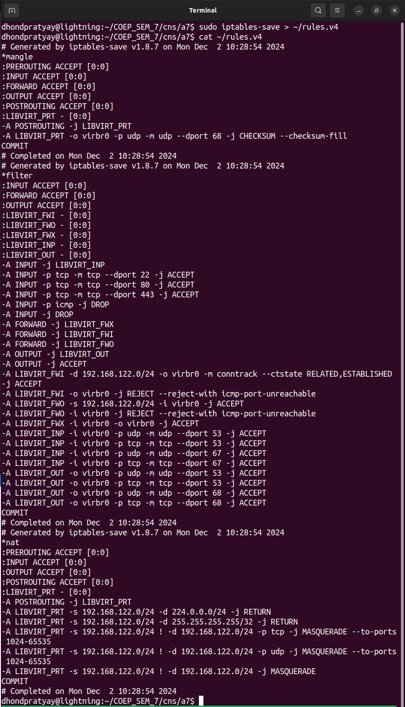
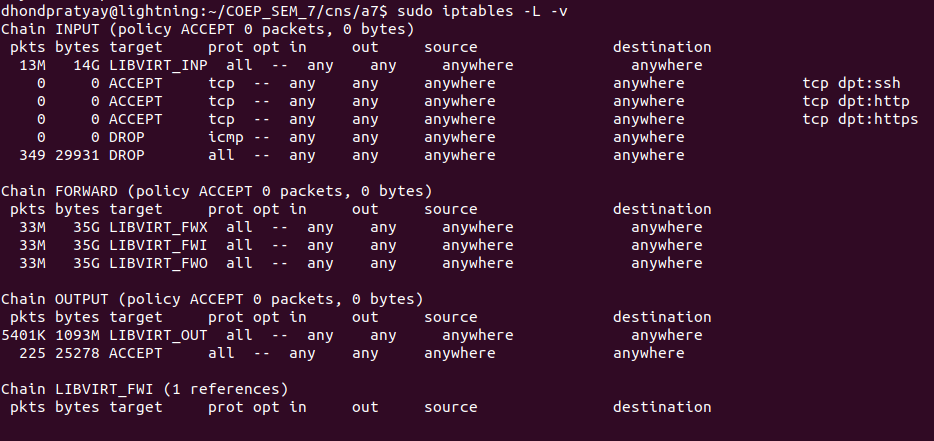

Assignment 7 
Install any Firewall and configure it as per the defined security policy. Prepare a small report on the same.

Using **IP TABLES**

###### 1. Installing iptables
```
sudo apt update
sudo apt install iptables
```

- Check Version
`iptables --version`

###### 2. Define Security Policy
- Block all incoming traffic except SSH, HTTP, and HTTPS.
- Allow all outgoing traffic.
- Drop all ping (ICMP) requests for security.

###### 3. Configuring iptables Rules

a. Allow SSH (port 22):
- `sudo iptables -A INPUT -p tcp --dport 22 -j ACCEPT`

b. Allow HTTP (port 80) and HTTPS (port 443):
- `sudo iptables -A INPUT -p tcp --dport 80 -j ACCEPT`
- `sudo iptables -A INPUT -p tcp --dport 443 -j ACCEPT`

c. Allow outgoing traffic:
- `sudo iptables -A OUTPUT -j ACCEPT`

d. Drop ICMP (ping):
- `sudo iptables -A INPUT -p icmp -j DROP`

e. Block all other traffic:
- `sudo iptables -A INPUT -j DROP`



###### 4. Save iptables Rules

To ensure rules persist after a reboot, save them with:

- `sudo iptables-save > /etc/iptables/rules.v4`
- 

###### 5. Verify Rules - Check the current rules using:
- `sudo iptables -L -v`


###### Results

The configured iptables successfully:
- Allowed essential traffic (SSH, HTTP, HTTPS).
- Blocked unauthorized incoming traffic and ping requests.
- Maintained all outgoing traffic as unrestricted.

###### Challenges and Solutions

**Challenge**: Rules reset after reboot.
Solution: Configured persistent rules using iptables-save.

**Conclusion**:
- iptables is a powerful tool for network traffic filtering. By configuring it to align with the defined security policy, we achieved a secure and controlled network environment.