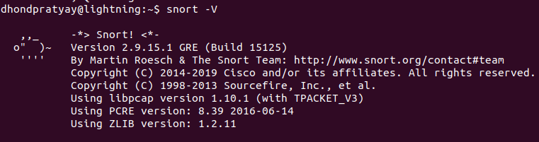
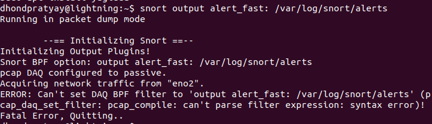
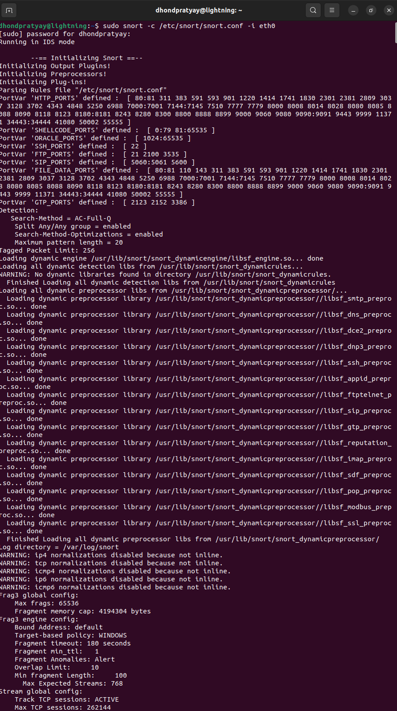
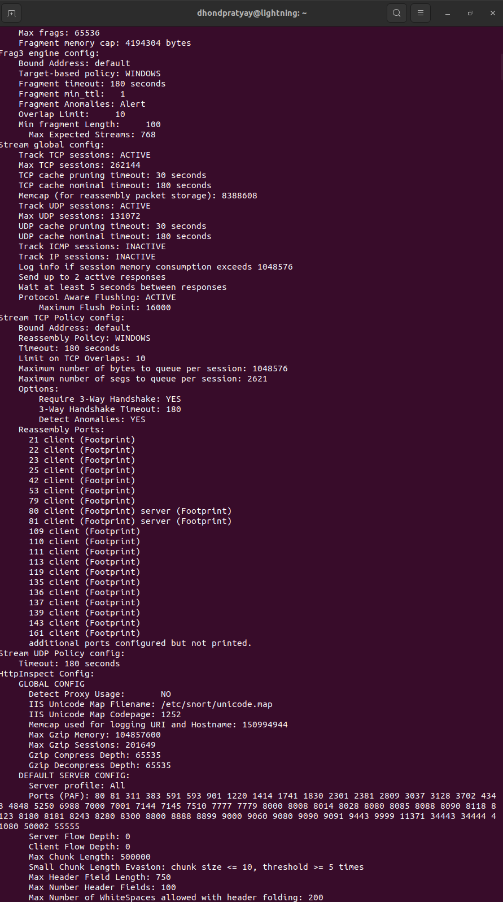
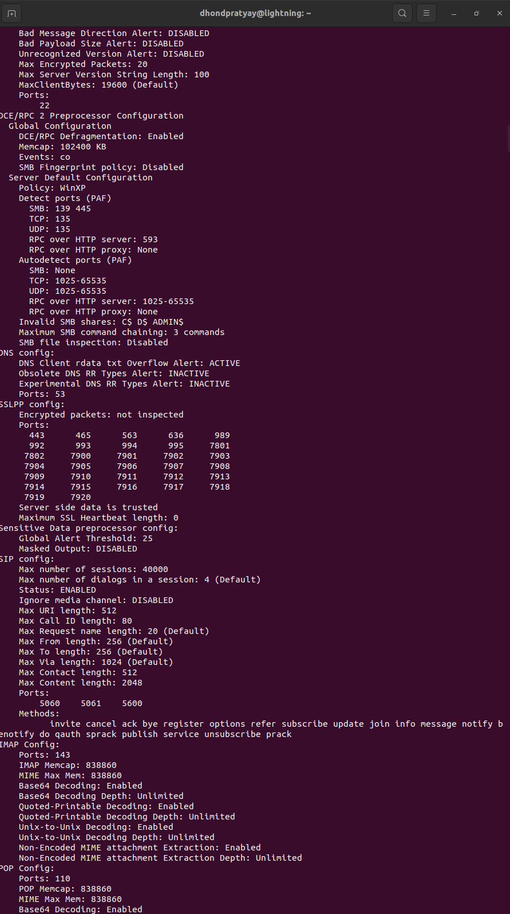
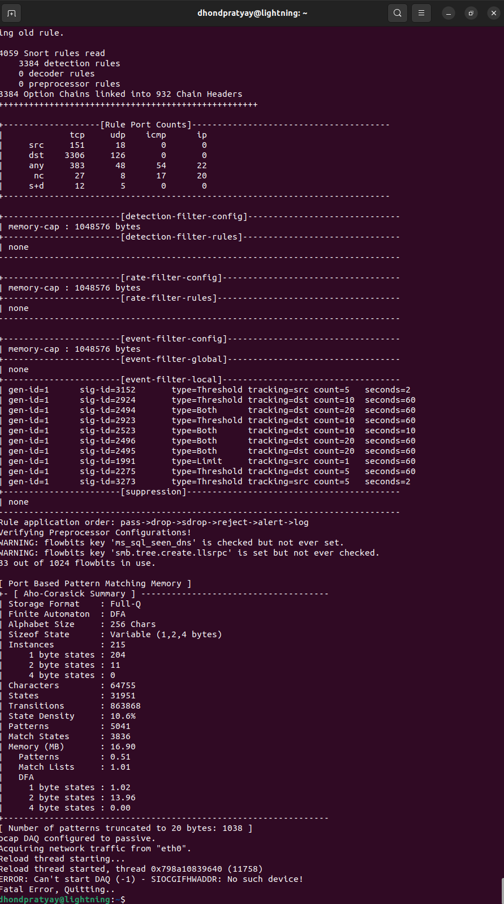

- Installing, configuring, and studying an Intrusion Detection System (IDS) using **Snort**, a popular open-source IDS.

### **Topic**: Installation, Configuration, and Study of an Intrusion Detection System (IDS)  

---

### **Objective**  
To install, configure, and analyze the functionality of Snort IDS for monitoring and detecting suspicious network activity.  

---

### **Steps to Implement**  

#### **1. What is Snort?**  
- Snort is a network intrusion detection and prevention system capable of performing packet logging, protocol analysis, and real-time traffic monitoring.
- It is an open-source IDS/IPS that monitors network traffic for malicious activity. 

---

#### **2. Installation of Snort**  
a. **Update System**  
   ```
   sudo apt update
   sudo apt upgrade
   ```  

b. **Install Required Dependencies**  
   ```
   sudo apt install -y snort
   ```  

c. **Verify Installation**  
   ```
   snort -V
   ```  
- 
---

#### **3. Configuration of Snort**  

a. **Edit Configuration File**  
   Open the Snort configuration file for editing:  
   ```bash
   sudo nano /etc/snort/snort.conf
   ```  
   Update:  
   ~ Define your network's home IP range:  
     ```bash
     var HOME_NET 192.168.1.0/24
     ```  
   ~ Include rule paths:  
     ```bash
     include $RULE_PATH/local.rules
     include $RULE_PATH/snort.rules
     ```  

b. **Create a Local Rules File**  
   Define custom rules in:  
   ```bash
   sudo nano /etc/snort/rules/local.rules
   ```  
   Example rule to alert on ICMP traffic:  
   ```bash
   alert icmp any any -> $HOME_NET any (msg:"ICMP Traffic Detected"; sid:1000001; rev:1;)
   ```  

c. **Enable Logging**  
   Specify a logging directory in `/etc/snort/snort.conf`:  
   ```bash
   output alert_fast: /var/log/snort/alerts
   ```  

---

#### **4. Running Snort**  

Run Snort in IDS mode:  
```bash
sudo snort -c /etc/snort/snort.conf -i eth0
```  
(`eth0` is an example; use your actual network interface name.)  
- 
- 
- 
- 

---

#### **5. Study and Analysis**  

a. **Generate Traffic**  
Test using `ping` or other tools to simulate malicious traffic:  
```bash
ping 192.168.1.1
```  

b. **Review Alerts**  
Check the logs for alerts in:  
```bash
cat /var/log/snort/alerts
```  

---

### **Results**  
Snort successfully detected suspicious traffic based on predefined rules, demonstrating its capability to monitor and secure network environments.  

---

### **Challenges and Solutions**  

**Challenge**: High false-positive rate due to overly generic rules.  
**Solution**: Fine-tuned rules to target specific traffic patterns.  

---

### **Conclusion**  
This exercise highlighted the importance of IDS systems like Snort in modern network security. With proper rule configuration, Snort acts as a reliable tool for detecting and preventing intrusions.  

**Future Work**: Experiment with advanced features such as Snort's inline mode for intrusion prevention.  

--- 

Feel free to adapt this report to match your observations during implementation!