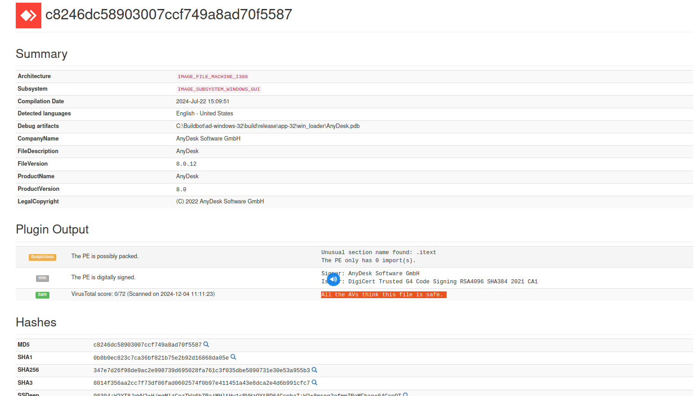
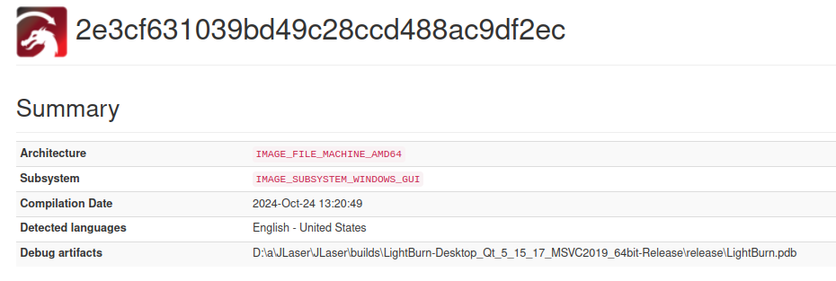
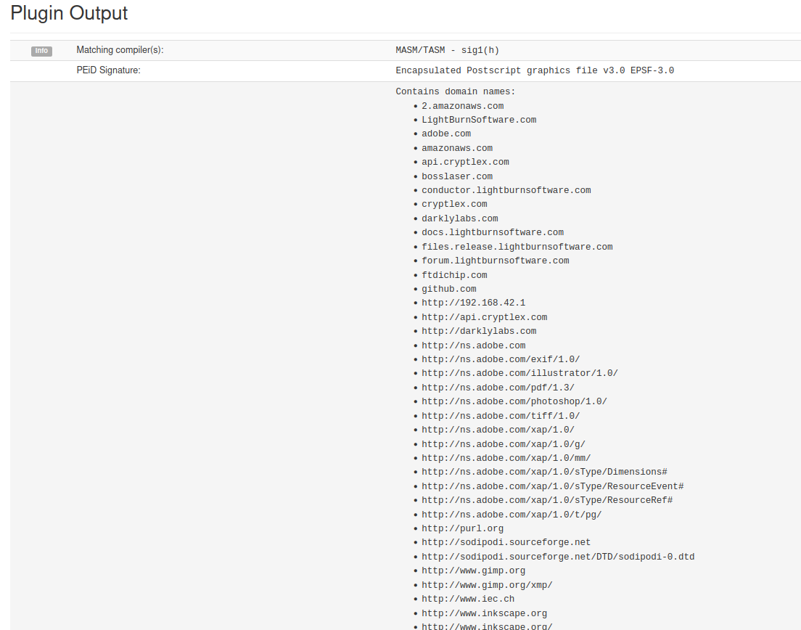
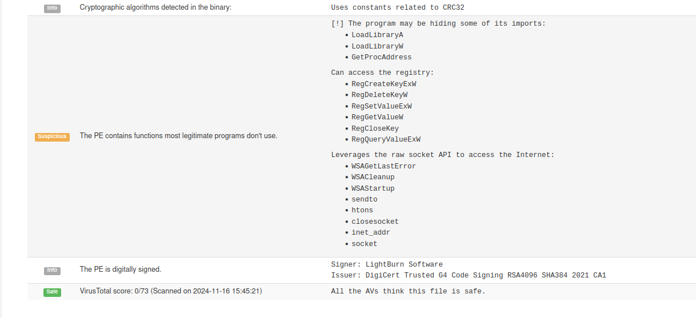
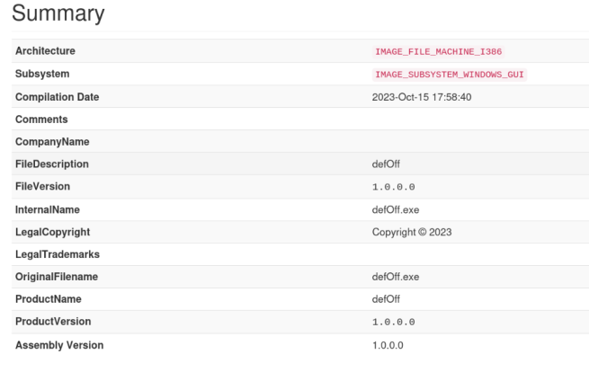
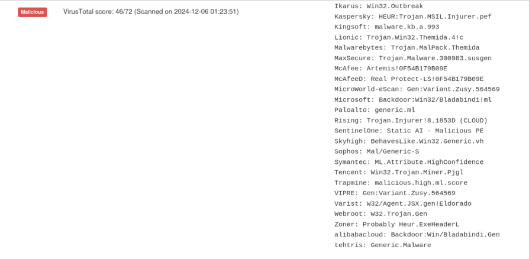
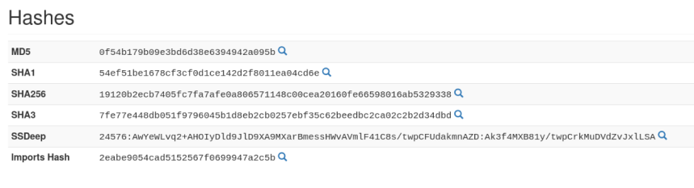

##### A valid safe executable file for Any desk

##### Infected File
 Summary of submitted file

 PEiD Signature: A PEiD signature is a signature used by the Packed Executable iDentifier (PEiD) tool to scan PE files for signatures, detect packers, and identify compilers: 
List of domain names it contains

Scans against virus files

#### Virus File

Summary

Virus Checks

 Various Hashes
